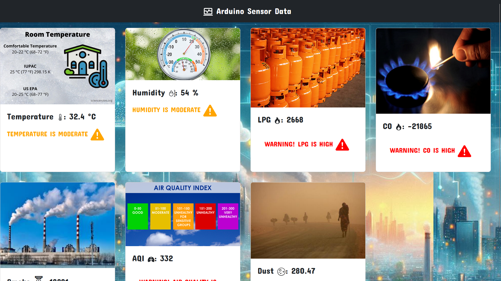
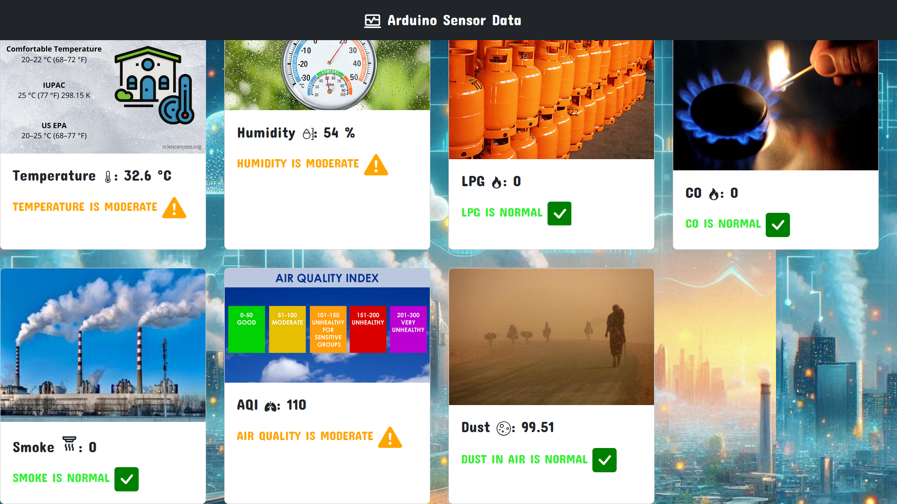

# Air Quality Monitoring System
#### Video Demo:  <https://youtu.be/3txN-h0Bpr4?si=ujHRgve65axasXra>

This project is an Air Quality Monitoring System using an Arduino that measures various air quality parameters such as dust, temperature, humidity, smoke, CO, LPG, and Air Quality Index (AQI). The data is displayed on an LCD monitor and a buzzer sounds an alarm when pollution levels are high. Additionally, the data is sent to a website for real-time display.
Features

    Measures dust, temperature, humidity, smoke, CO, LPG, and AQI.
    Displays data on an LCD screen.
    Sounds a buzzer alarm when pollution levels are high.
    Sends data to a website for real-time display.
    Stores readings in a CSV file.

## Components

    Arduino Uno
    DHT11 Sensor (for temperature and humidity)
    MQ2 Sensor (for CO, SMOKE and LPG detection)
    MQ135 Sensor (AQI)
    Dust Sensor
    LCD Display
    Buzzer
    Resistors, wires, and breadboard

## Installation

    Hardware Setup:
        Connect the DHT11 sensor to the Arduino.
        Connect the MQ135 sensor to the Arduino.
        Connect the dust sensor to the Arduino.
        Connect the LCD display to the Arduino.
        Connect the buzzer to the Arduino.
        Refer to the circuit diagram for detailed connections.

    Software Setup:
        Install the Arduino IDE from Arduino's official website.
        Install the required libraries in the Arduino IDE:
            DHT sensor library
            LiquidCrystal
            Wire
        Open the Arduino IDE and load the provided .ino file.

## Usage

    Uploading the Code:
        Connect your Arduino board to the computer.
        Open the .ino file in the Arduino IDE.
        Select the correct board and port from the Tools menu.
        Click on the upload button to upload the code to the Arduino.

    Running the System:
        Once the code is uploaded, the system will start measuring air quality parameters.
        The readings will be displayed on the LCD screen.
        If pollution levels are high, the buzzer will sound an alarm.
        The data will be sent to the connected website for real-time display.

Future Improvements

    Adding more sensors for detecting other gases.
    Improve the website interface for better data visualization.
    Implement a mobile app for real-time monitoring on smartphones.

License

This project is licensed under the MIT License - see the LICENSE file for details.
Contact
